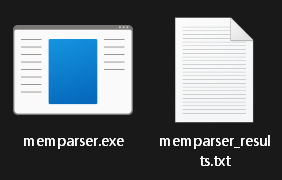

# Overview

- [memparser](#memparser)
- [Requirements](#requirements)
- [Usage](#usage)
- [Known Issues](#bugs)
- [VirusTotal](#virustotal)
- [License](#license)

# memparser

This is a memory image analysis tool designed to extract and process information related to file access or execution evidence from a RAM memory dump. The tool scans the memory image, identifies specific patterns, and provides insights into executed files, potentially deleted files, and more.

## Requirements

Before using this tool, ensure that you have the following:

- A RAM memory dump file for analysis. The program supports every memory image file extension (such as .raw, .mem, .img) and txt.
- A Windows environment to run the executable:
  
  1. Any Windows Server version
  2. Windows 7 or above.
     
- The following dll files (attached in the "releases" section) near memparser.exe

The program does not need administrator privileges or network connection to run.

## Usage

1. Run the Program:

- Execute the compiled binary, providing the memory image file as an argument.

Example:
memparser.exe C:\Users\PC\Downloads\memdump.mem

- You can also drag your memory dump to the program to start analyzing it.
- If you run the program without arguments, the program will ask you for a path to the memory image file that you want to analyze.

2. Output Choices:

- You can choose to print the results to the console (C) or to a file (F) when prompted.
- If you choose to send the results to a file (F), the program will generate a memdump_results.txt in the path where memparser.exe is located.

3. View Results:

- The tool will analyze the memory image and display or save the matched strings, providing insights into executed and potentially deleted files.

 

- When the memory image file is fully analyzed, "Scan finished. Press Enter to exit the program..." will be printed to the console.

 

### Usage Notes

- Stop the scanning process:

If you want to stop the scanning process, you can do so at any time by pressing the keys "Ctrl + C" simultaneously, or by just killing the "memparser.exe" process in the task manager, under the running "Command Prompt" application.

## Features

- Fast scanning algorithm.
- Low memory impact: The program will not allocate more than 1MB of memory in your computer.
- Low requirements: The program will not ask you for special permissions to run.
- Identifies file access evidence.
- Provides information about executed files.
- Detects executed deleted files.
- Text color for console output.
- Converts non human readable paths into readable and accessible paths.
- (Soon) Detects digitally unsigned executed files.

## Bugs

- The code may provide inaccurate path results for executed files detections, that are easily identifiable.
Example:
C:\Windows\system32\rundfile:\C:\Program Files\InternetExplorer\iexplore.exe

 

## VirusTotal

The program and its dynamic link library files are not flagged as malware by any antivirus provider.

- memparser.exe (0/70 detections): 
https://www.virustotal.com/gui/file/d9453b63b30612f4d6599676a2bdd7a67c58e095b418e7c695d0c1f7911f6542?nocache=1

- libgcc_s_seh-1.dll (0/70 detections): 
https://www.virustotal.com/gui/file/4ba4820b9b3b7cae64b195ec4c003be566168979e9813bc0dbfb24bbf84a5e8f

- libstdc++-6.dll (0/71 detections): 
https://www.virustotal.com/gui/file/515c1cc0163eb5a5294bf18b4980019cb1c7e7279830048b4cc81db8a2736770

- libwinpthread-1.dll (WinPthreadGC - 0/70 detections): 
https://www.virustotal.com/gui/file/2b18435ba46bc13c5261e88dbde7c0fe0dbf0fd18c6ccc2617e5731a4b462005

## License

This project is licensed under the MIT License. You are granted permission to use, modify, distribute, and sublicense the software, both for commercial and non-commercial purposes.

You must include a copy of the MIT License and the original copyright notice in all copies or substantial portions of the software. This means that you need to retain the license text and acknowledge the original author.
